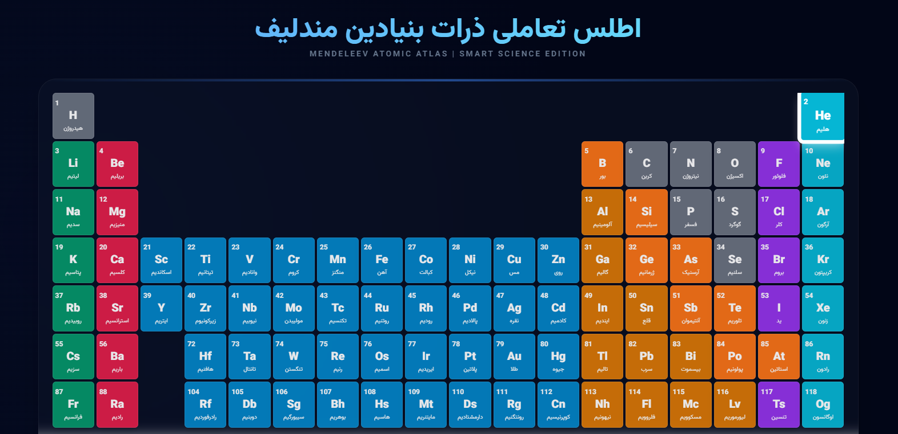
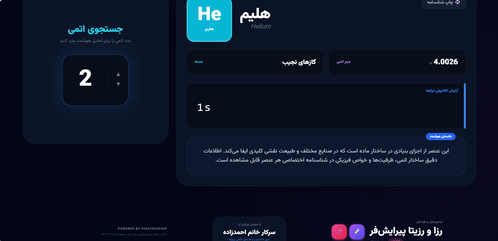

# ⚛️ آزمایشگاه مجازی مندلیف (کاوشگر اتمی)

> **یک تجربه هوشمند و تعاملی برای یادگیری علوم تجربی - پایه نهم**  
> این اپلیکیشن با هدف تبدیل یادگیری خشک جدول تناوبی به یک تجربه بصری و لذت‌بخش طراحی شده است.

  
  

  <em>تصاویر بالا: نمایی از جدول تعاملی و جزئیات یک عنصر با هوش مصنوعی</em>

---
## 🚀 راهنمای استقرار در Vercel (مخصوص دانش‌آموزان)
برای اینکه برنامه شما به صورت آنلاین اجرا شود و هوش مصنوعی آن فعال گردد:

1. **آپلود در گیت‌هاب:** کدهای پروژه را در حساب GitHub خود قرار دهید.
2. **ورود به Vercel:** با اکانت گیت‌هاب در [vercel.com](https://vercel.com) وارد شوید.
3. **ایجاد پروژه:** دکمه `Add New Project` را بزنید و این مخزن را انتخاب کنید.
4. **تنظیم کلید هوشمند (بسیار مهم):**
   - به بخش **Settings** و سپس **Environment Variables** بروید.
   - نام متغیر را دقیقاً `API_KEY` بگذارید.
   - مقدار آن را کلیدی که از Google AI Studio گرفته‌اید قرار دهید.
5. **انتشار:** دکمه **Deploy** را بزنید و تمام! 🌟

... بقیه متن README مثل قبل ادامه پیدا می‌کنه ...
